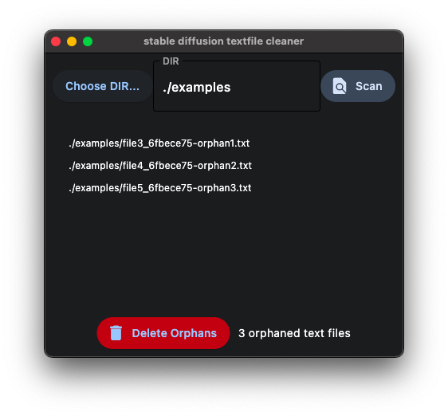

# Deletes any `.txt` files when no `.png` is present

For use in stable diffusion output directories etc.

## Why

Stable Diffusion typically saves a `.txt` files for each `.png` file. If you delete the `.png` file, the `.txt` file is orphaned. This program will delete those orphaned `.txt` files.

This means you can concentrate on deleting the .png files you don't want, rather than trying to always delete both the image and the corresponding `txt` or `yaml` files.  Simply run the cleaner and let this program later delete the orphan .txt files.

# Installation

    pip install flet

# Run

    python ui.py

## Usage

Select a directory and click "Scan". The program will list all text files or yaml files in the directory that do not have a corresponding .png file.

Then simply hit the "Delete" button to delete those 'orphan' files.

# Advanced Usage

When upscaling images, the `txt` files and the `png` files will have different names.  The `.png` will typically have a suffix like `_RealESRGAN_x4plus` to indicate the upscaling factor.  The `.txt` file will not have this suffix.  This program will still delete the orphaned `.txt` files.

You can edit the suffixes that will be accounted for in the 'ignore suffixes' box.  TODO.

# TODO

- Image browser.  Shows preview of images as well as the prompt text, retrieved from the `.txt` file.
- Fix all the state stuff.

# License

MIT
